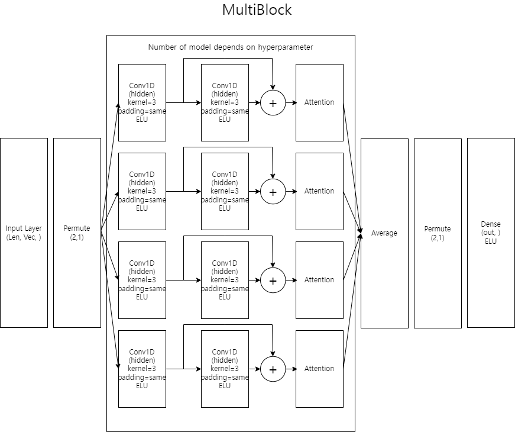
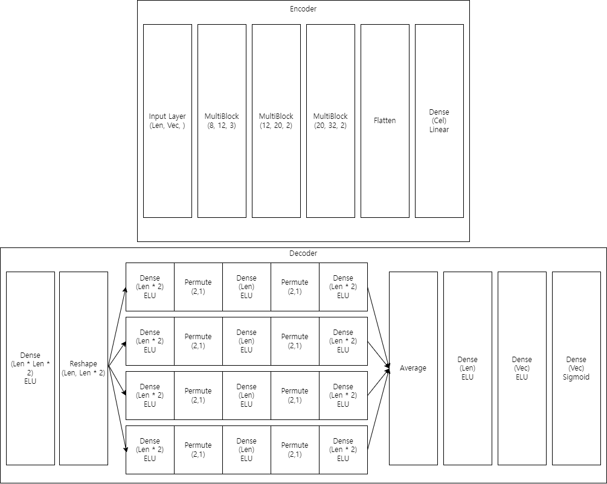
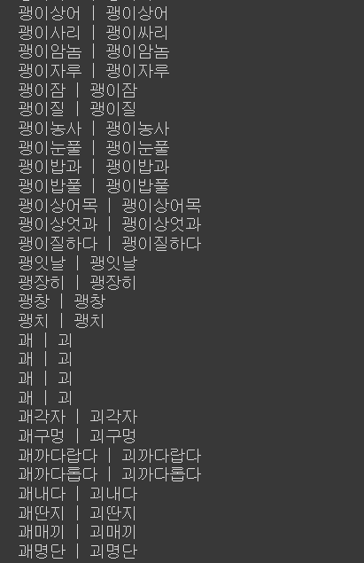
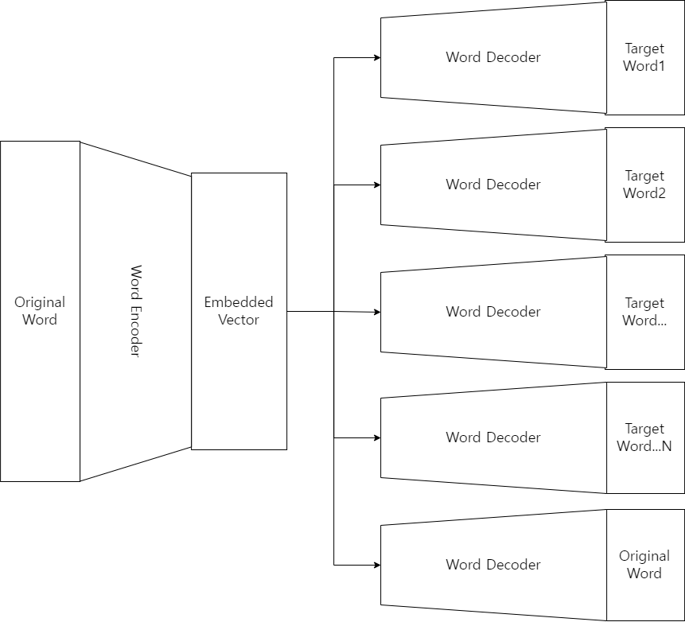

# 소개
한국어를 AutoEncoder를 사용하여 벡터로 임베딩하는 프로젝트입니다.  

기존의 One-Hot 방식의 임베딩은 단어의 갯수가 많을수록 필요로 하는 메모리가 기하급수적으로 증가하는 문제점이 존재합니다. 이를 해결하기 위해 Sparse Matrix와 같은 방식으로 표현하였지만 Sparse Matrix의 형태로는 활용 가능한 라이브러리가 적다는 단점이 존재합니다. 
또한 새로운 단어가 들어올 경우 벡터의 크기가 증가하여 거기에 맞춰 코드를 다시 수정해야하는 번거로움이 있습니다.  

따라서 단어를 일정 크기의 벡터로 일관되게 임베딩한다면 이러한 문제를 해결할 수 있습니다.

# 설명
본 프로젝트에서는 오픈소스 라이브러리인 jamo(https://github.com/jdongian/python-jamo)를 이용하여 단어를 자모음으로 분리하였고 hangul-utils 라이브러리(https://github.com/kaniblu/hangul-utils)를 이용하여 자모음을 다시 단어로 합쳤습니다. 
그 다음 자모음 각각을 벡터로 임베딩하기 위해 jamodict를 고안하였습니다. jamodict는 현대 한국에서 주로 사용되는 자음과 모음을 각각의 특성에 따라 길이가 15인 벡터로 정의합니다. 
벡터의 각 요소의 의미는 다음과 같습니다 
<h3>[양순음,치조음,경구개음,연구개음,후음,예사소리(0)된소리(0.5)거센소리(1),파열음,파찰음,마찰음,비음,유음,ㅓ(0.33))ㅣ(0.67)ㅏ(1), ㅜ(0.33)ㅡ(0.67)ㅗ(1), ㅣ추가, ·추가]</h3>
ㅓㅣㅏ,ㅗㅡㅜ가 각각 0부터 시작하지 않는 이유는 다른 자모음과의 구분을 위함입니다. 
그리고 겹받침(ㄼ, ㅀ, ㄶ 등)은 두 자음 벡터를 더한 뒤 2로 나눈 평균값입니다. 
또한 아무런 자모음을 나타내지 않는 ''는 데이터의 편향을 방지하기 위해 겹받침을 제외한 자모음 벡터의 평균값으로 설정했습니다.  
데이터는 <a src="https://kbig.kr/portal/kbig/knowledge/files/bigdata_report.page?bltnNo=10000000016451">K-ICT에서 제공하는 빅데이터</a>를 사용하였습니다. 
단어 중에서 jamodict에 들어있지 않은 자모음을 포함하거나 한글이 아닌 다른 문자를 포함하는 등의 단어는 제외하였습니다. 또한 메모리 문제로 일정 크기 이상의 자모음 길이를 갖는 단어 또한 제외하였습니다  

AutoEncoder를 사용하여 데이터를 인코딩 할 경우 생기는 잠재적인 문제점은 만약 데이터의 길이보다 인코딩 된 벡터의 길이가 긴 경우 AutoEncoder의 신경망은 입력 데이터를 그대로 출력데이터로 보내게 됩니다. 그 결과 인코딩 된 벡터의 일부가 제대로 활용되지 않게 됩니다. 
따라서 이러한 문제를 해결하기 위해 MultiBlock이라는 작은 신경망을 여럿 사용한 앙상블 기법을 이용하였습니다. MultiBlock 내부의 서브 모델은 각각은 입력 데이터의 크기보다 작은 hidden 레이어를 갖기 때문에 단어를 인코딩하기 위한 충분한 정보가 제공되지 않습니다. 그러나 이러한 서브 모델을 여러개 병렬로 사용하여 결과를 평균을 내기 때문에 결과적으로 데이터를 인코딩하기 위한 정보는 충분하게 됩니다. 즉, MultiBlock은 입력 데이터로부터 최대한 정보를 얻어내기 위해 노력할 것이고 그로인해 AutoEncoder는 인코딩 된 벡터를 최대한 효율적으로 사용하게 됩니다. 

</img> 
</img> 

BatchNormalization, Dropout 등의 레이어는 그림에서 제외하였습니다. 
또한 Decoder 부분에서는 그림에 반영되지 않은 Residual connection이 존재합니다. 
# 사용법
코드는 구글 Colab을 기준으로 작성되었습니다. 따라서 사용법 또한 구글 Colab을 전제로 작성합니다. 
먼저 NIADic.xlsx를 Colab에 업로드 합니다. 
그 이후 모두 실행을 하면 됩니다 
model.h5를 같이 업로드 하면 바로 결과만 테스트 할 수 있습니다. 
# 결과
 
정확도는 0.9 수준으로 잘 작동하는 것으로 보이나 위와 같이 ㅙ, ㅚ 처럼 비슷한 발음을 구별하지 못하는 현상이 존재합니다. 
이는 ㅙ와 ㅚ가 jamodict 사전상에서 거리가 겨우 0.333... 수준의 가까운 거리인 것 때문으로 보입니다. 
그러나 ㅙ와 ㅚ는 사람도 사전 지식 없이 들으면 구별이 불가능한 발음이므로 이는 역설적으로 jamodict의 벡터가 꽤 잘 설계되었음을 나타내는 반증입니다.

# 향후 연구과제
한국어 단어를 어느정도 유의미한 수준의 정확도로 임베딩이 가능한 만큼 이를 기반으로 다른 응용을 해볼 수 있습니다. 
예를들어 GAN과 접목할 경우 인공적인 단어를 만들어 낼 수 있을 것으로 보입니다. 특히, 특정 주제(비속어, 인터넷 유행어 등)로 수집한 데이터를 이용하여 그럴듯한 해당 주제의 인공 단어를 생성해 낼 수 있을 것으로 사료됩니다. 
거기에 Conditional GAN과 Sentiment Analysis 방법을 도입하면 특정 감정이 느껴지는 인공 단어 또한 생성 가능할 것으로 보입니다. 

또한 기존의 단어 순서를 학습하기 위한 CBOW, Skip-gram 알고리즘을 응용하여 단어 순서 학습 또한 가능할 것으로 예상됩니다. 특히, 기존 CBOW, Skip-gram 알고리즘은 단어를 먼저 One-Hot 인코딩을 하여 처리하였으나 이번 프로젝트를 사용하면 알고리즘 신경망에 Encoder와 Decoder를 통합시켜 별도의 인코딩 없이 단어 순서 및 임베딩을 동시에 달성해 낼 수 있을 것으로 보입니다. 
아래는 Skip-gram에 인코더와 디코더를 통합시킨 예시입니다. 
 
위 사진에서 Word Decoder는 모두 같은 가중치를 공유합니다.